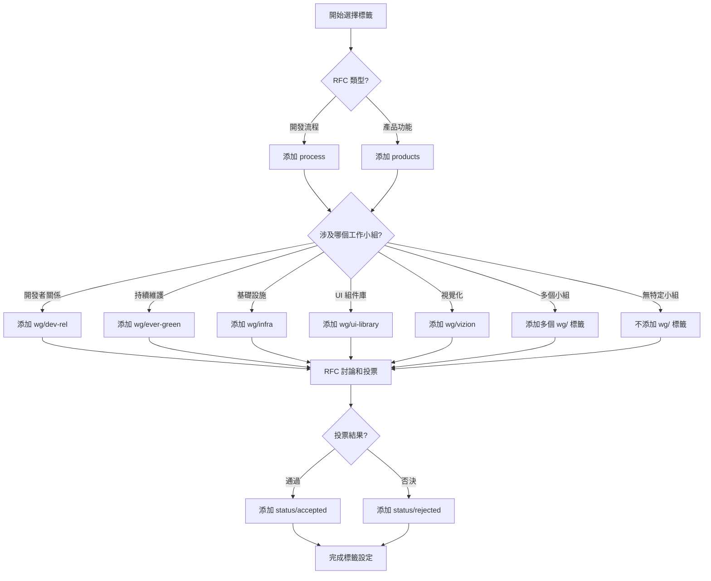

# RFC Labels Usage Guide

RFC Issues 的標籤使用指南，幫助正確分類和追蹤 RFC。

**來源專案：** moxa/sw/f2e/one/one-rfcs

## 標籤分類系統

RFC 使用兩層標籤系統：
1. **狀態標籤** - 表示 RFC 的決議狀態
2. **分類標籤** - 表示 RFC 的內容類別

## 狀態標籤 (Status Labels)

狀態標籤用於標示 RFC 的最終決議結果，**僅在結案時使用**。

### status/accepted

- **用途**: 標示通過的 RFC
- **使用時機**: 投票通過後，歸檔 MR 合併後，Issue 關閉前
- **對應狀態**: Issue Status 應設為 `Done`
- **歸檔位置**: `archived/accepted/`

**使用範例：**
```
RFC-42: Monorepo Build Optimization
標籤: status/accepted, process, wg/infra
狀態: Done
```

### status/rejected

- **用途**: 標示否決的 RFC
- **使用時機**: 投票否決後，歸檔 MR 合併後，Issue 關閉前
- **對應狀態**: Issue Status 應設為 `Won't Do`
- **歸檔位置**: `archived/rejected/`

**使用範例：**
```
RFC-43: RxJS State Management
標籤: status/rejected, process, wg/ui-library
狀態: Won't Do
```

## 分類標籤 (Category Labels)

分類標籤用於將 RFC 歸類到不同的領域或工作小組，**在建立 Issue 時就應該設定**。

### process

- **適用情境**: 開發和協作流程相關的 RFC
- **使用場景**:
  - 開發流程改進
  - 協作規範制定
  - 工作方法優化
  - 團隊流程標準化

**使用範例：**
- Code review 流程優化
- Git branching 策略
- 版本發布流程
- 文件撰寫規範
- Pull Request 規範
- 測試流程標準

### products

- **適用情境**: 特定產品的技術決策
- **使用場景**:
  - 產品功能開發
  - 產品架構調整
  - 產品技術選型
  - 產品重構計劃

**使用範例：**
- one-ui 登入頁面重構
- nxos 平台功能開發
- 產品 A 的狀態管理方案
- 產品 B 的效能優化

## 工作小組標籤 (Working Group Labels)

工作小組標籤用於將 RFC 分配到特定的技術小組或領域。

### wg/dev-rel

- **完整名稱**: Developer Relations 工作小組
- **適用情境**: DevRel 相關的 RFC
- **關注領域**:
  - 開發者體驗
  - 技術文件
  - 開源貢獻
  - 社群建設
  - 技術推廣

**使用範例：**
- 開發者文檔系統建置
- 技術部落格平台
- 開源專案貢獻指南
- 技術分享會機制

### wg/ever-green

- **完整名稱**: Evergreen 工作小組
- **適用情境**: 持續維護和更新相關的 RFC
- **關注領域**:
  - 依賴套件更新
  - 技術債處理
  - 長期維護策略
  - 版本升級計劃

**使用範例：**
- 依賴套件自動更新機制
- 技術債還債計劃
- 舊版本支援策略
- 框架版本升級規劃

### wg/infra

- **完整名稱**: Infrastructure 工作小組
- **適用情境**: 基礎設施相關的 RFC
- **關注領域**:
  - CI/CD 流程
  - 部署策略
  - 系統架構
  - 開發環境
  - 監控和日誌

**使用範例：**
- CI/CD pipeline 優化
- Docker 容器化策略
- Monorepo 建置系統
- 開發環境標準化
- 監控系統建置

### wg/ui-library

- **完整名稱**: UI Library 工作小組
- **適用情境**: UI 組件庫和設計系統相關的 RFC
- **關注領域**:
  - 組件庫開發
  - 設計系統
  - UI 規範
  - 主題系統
  - 可訪問性

**使用範例：**
- 設計系統建置
- 組件 API 設計
- 主題切換機制
- 無障礙支援規範
- 組件文檔系統

### wg/vizion

- **完整名稱**: Vizion 工作小組
- **適用情境**: 視覺化和數據展示相關的 RFC
- **關注領域**:
  - 數據視覺化
  - 圖表組件
  - Dashboard 設計
  - 數據展示工具

**使用範例：**
- 圖表庫選型
- Dashboard 架構設計
- 數據視覺化規範
- 即時數據展示方案

## 標籤組合使用

RFC 可以同時使用多個標籤，但應該遵循以下原則：

### 基本組合規則

1. **必選標籤**（至少選一個）:
   - `process` 或 `products`

2. **可選標籤**（視 RFC 內容選擇 0-N 個）:
   - 工作小組標籤 (`wg/`)

3. **結案時添加**（二選一）:
   - `status/accepted` 或 `status/rejected`

### 組合範例

**範例 1: 基礎設施流程改進**
```
標籤組合: process, wg/infra
說明: 開發流程改進，屬於基礎設施工作小組範疇
```

**範例 2: UI 組件庫產品開發**
```
標籤組合: products, wg/ui-library
說明: 特定產品的技術決策，屬於 UI Library 工作小組
```

**範例 3: 跨多個工作小組的流程**
```
標籤組合: process, wg/infra, wg/ever-green
說明: 同時涉及基礎設施和持續維護兩個工作小組
```

**範例 4: 已通過的 RFC**
```
標籤組合: status/accepted, process, wg/infra
說明: 已通過的基礎設施流程改進 RFC
```

## 標籤選擇流程圖



## 標籤使用時機

### Issue 建立時

**必須設定：**
- `process` 或 `products`（至少一個）
- 相關的 `wg/` 標籤（如適用）

**範例：**
```
新建 RFC: Monorepo Build Optimization
初始標籤: process, wg/infra
```

### 討論期間

**標籤維持不變**，除非：
- RFC 範圍改變（調整分類標籤）
- 涉及的工作小組變更（調整 wg/ 標籤）

### 投票結束後

**不要立即添加狀態標籤**，等待：
1. 歸檔 MR 建立
2. 歸檔 MR 審核通過
3. 歸檔 MR 合併完成

### MR 合併後

**添加狀態標籤：**
- 通過 → 添加 `status/accepted`
- 否決 → 添加 `status/rejected`

**同時更新 Issue Status：**
- 通過 → 設為 `Done`
- 否決 → 設為 `Won't Do`

### Issue 關閉

確認標籤完整性：
- ✅ 分類標籤 (process/products)
- ✅ 工作小組標籤 (wg/，如適用)
- ✅ 狀態標籤 (status/accepted 或 status/rejected)

## 常見錯誤

### ❌ 錯誤 1: 同時使用兩個狀態標籤

```
錯誤: status/accepted, status/rejected
正確: status/accepted (二選一)
```

### ❌ 錯誤 2: 未設定分類標籤

```
錯誤: wg/infra (缺少 process 或 products)
正確: process, wg/infra
```

### ❌ 錯誤 3: 投票後立即添加狀態標籤

```
錯誤時機: 投票通過 → 立即添加 status/accepted
正確時機: 投票通過 → 歸檔 MR 合併 → 添加 status/accepted
```

### ❌ 錯誤 4: 討論期間添加狀態標籤

```
錯誤: 討論期間就添加 status/accepted
正確: 只在結案時添加狀態標籤
```

## 標籤查詢範例

使用 GitLab MCP 工具查詢特定標籤的 RFC：

### 查詢所有通過的 RFC

```
mcp__gitlab__list_issues(
  project_id="moxa/sw/f2e/one/one-rfcs",
  labels=["status/accepted"]
)
```

### 查詢基礎設施相關的 RFC

```
mcp__gitlab__list_issues(
  project_id="moxa/sw/f2e/one/one-rfcs",
  labels=["wg/infra"]
)
```

### 查詢進行中的流程改進 RFC

```
mcp__gitlab__list_issues(
  project_id="moxa/sw/f2e/one/one-rfcs",
  labels=["process"],
  state="opened"
)
```

### 查詢 UI Library 工作小組已否決的 RFC

```
mcp__gitlab__list_issues(
  project_id="moxa/sw/f2e/one/one-rfcs",
  labels=["status/rejected", "wg/ui-library"]
)
```

## 總結

### 標籤設定檢查清單

**Issue 建立時：**
- [ ] 添加 `process` 或 `products`
- [ ] 添加相關的 `wg/` 標籤（如適用）
- [ ] 不要添加狀態標籤

**討論期間：**
- [ ] 標籤保持穩定
- [ ] 僅在範圍變更時調整

**投票後：**
- [ ] 記錄投票結果
- [ ] 建立歸檔 MR
- [ ] 等待 MR 合併

**MR 合併後：**
- [ ] 添加 `status/accepted` 或 `status/rejected`
- [ ] 更新 Issue Status
- [ ] 關閉 Issue

### 快速參考表

| 標籤 | 類型 | 使用時機 | 必選 |
|------|------|----------|------|
| `process` | 分類 | Issue 建立 | 與 products 二選一 |
| `products` | 分類 | Issue 建立 | 與 process 二選一 |
| `wg/dev-rel` | 工作小組 | Issue 建立 | 可選 |
| `wg/ever-green` | 工作小組 | Issue 建立 | 可選 |
| `wg/infra` | 工作小組 | Issue 建立 | 可選 |
| `wg/ui-library` | 工作小組 | Issue 建立 | 可選 |
| `wg/vizion` | 工作小組 | Issue 建立 | 可選 |
| `status/accepted` | 狀態 | MR 合併後 | 與 rejected 二選一 |
| `status/rejected` | 狀態 | MR 合併後 | 與 accepted 二選一 |
