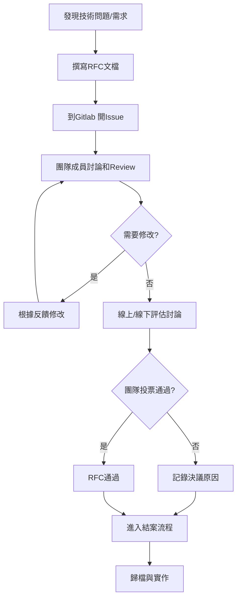

# RFC Complete Workflow Reference

完整的 RFC（Request for Comments）流程文件，包含從提案到實作的所有階段。

**來源專案：** moxa/sw/f2e/one/one-rfcs

## RFC 流程概覽



## 階段 1: 發現技術問題/需求

識別需要解決的技術問題或改進需求：
- 分析現有系統的痛點和限制
- 收集團隊成員的反饋和建議
- 評估業務需求和技術趨勢

## 階段 2: 撰寫 RFC 文檔

使用 GitLab Issue Template 建立結構化提案。

### 填寫步驟

1. 在 GitLab 專案中點擊 **New Issue**
2. 選擇 **RFC 提案** 模板
3. 填寫所有 🟢 **必填區塊**：
   - **RFC 資訊**: RFC 編號、提案者、相關人員、提案日期
   - **問題/動機描述**: 詳細說明要解決的問題和動機
   - **解決方案**: 提供核心解決方案和技術實作概要
   - **影響評估**: 評估相容性、效能、維護和學習成本
   - **風險評估**: 識別風險並提供緩解策略
   - **提交前檢查清單**: 確認所有必要項目已完成

4. 依需求填寫 🟡 **選填區塊**：
   - **替代方案**: 列出考慮過的其他方案及優缺點比較
   - **實作計劃**: 制定詳細的實作步驟和時程
   - **參考資料**: 相關文件、連結、範例

### RFC 編號規則

RFC 編號使用對應的 GitLab Issue ID，這樣可以直接追蹤 RFC 與原始討論 Issue 的關聯性。

範例：
- `archived/accepted/42-monorepo-build-optimization.md`
- `archived/rejected/43-rxjs-state-management.md`

## 階段 3: 加上對應的標籤和指派

正確分類和通知相關人員。

### 標籤選擇

**Issue 狀態標籤：**
- `status/accepted` - 通過
- `status/rejected` - 不通過

**Issue 分類標籤：**
| 標籤 | 適用情境 | 範例 |
|------|----------|------|
| `process` | 開發和協作流程 | Code review 流程、版本發布策略、文件撰寫規範 |
| `products` | 特定產品的決策 | one-ui 登入頁面重構、nxos 平台功能開發 |
| `wg/dev-rel` | DevRel 工作小組相關 | 開發者關係、社群建設、技術推廣 |
| `wg/ever-green` | Evergreen 工作小組相關 | 持續更新、維護策略、長期支援 |
| `wg/infra` | 基礎設施工作小組相關 | CI/CD、部署流程、系統架構 |
| `wg/ui-library` | UI Library 工作小組相關 | 設計系統、組件庫、介面規範 |
| `wg/vizion` | Vizion 工作小組相關 | 視覺化工具、數據展示、圖表組件 |

### 人員指派

- 標註 (`@`) 相關團隊成員和技術負責人
- 確保關鍵參與者都收到通知

## 階段 4: 設定 Issue 時程和狀態

設定討論時程並開啟討論階段。

### 設定時程

- **Start Date (起始時間)**: 設定為討論開始的日期
- **Due Date (結束時間)**: 設定討論截止日期
  - 建議討論期間為 2-3 週
  - 最長不超過一個月

### 切換狀態

- 將 Issue Status 從 `To Do` 切換為 `In progress`
- 表示 RFC 正式進入討論階段

## 階段 5: 團隊成員討論和 Review

在 GitLab Issue 中進行公開討論和技術審查。

### 討論重點

- 技術可行性分析
- 實作細節討論
- 潛在風險評估
- 替代方案比較
- 時程和資源評估

### 參與者角色

- **提案者**: 回答問題、澄清細節、修改提案
- **負責人**: 評估業務影響和優先級
- **團隊成員**: 提出疑問和改進建議

### 修改迭代

根據反饋修改提案，直到達成共識或確定投票方向。

## 階段 6: 線上線下評估討論

提案者依照討論狀況判斷是否召開會議進行深入評估。

### 會議準備

- 整理 Issue 討論結果
- 準備技術展示或 POC（如適用）
- 準備成本效益分析

### 會議流程

- 技術討論和 Q&A
- 風險評估和緩解策略討論

### 決策制度：團隊多數決制

- **決策方式**: 關鍵參與者公開投票，超過 50% 同意即可通過
- **關鍵參與者**: RFC 上有提及到的相關人員
- **投票方式**: 在 Issue 中使用 emoji 表達意見
  - 👍 (贊成)
  - 👎 (反對)
  - 👀 (保留)
- **投票期限**: 討論期結束後 48 小時內完成投票
- **適用場景**: 影響範圍明確、爭議性較低、團隊共識度高的提案

### 投票流程

- 在 GitLab Issue 中進行留言投票
- 達成共識標準：相關人員中，超過 50% 同意票

## 階段 7: RFC 結案流程

### 投票結果統計

- 計算關鍵參與者的投票比例
- 超過 50% 同意票 → RFC 通過
- 未達 50% 同意票 → RFC 否決

### RFC 通過的處理流程

**由提案者執行：**

1. **記錄決議結果**
   - 在 Issue 中記錄投票結果
   - 整理關鍵決策內容和共識

2. **準備進行歸檔**
   - 直接進入歸檔流程

### RFC 否決的處理流程

**由提案者執行：**

1. **記錄否決原因**
   - 在 Issue 中詳細記錄否決理由
   - 說明決策考量因素
   - 整理投票結果和主要反對意見

2. **標註結束日期**
   - 記錄 RFC 否決的正式日期

3. **準備進行歸檔**
   - 直接進入歸檔流程

## 階段 8: 歸檔作業

**由提案者執行。**

**重要：** 投票決議後即可進行歸檔，無需等待實作完成。歸檔 MR 合併後，才能更新 Issue 狀態和關閉 Issue。

### 歸檔步驟

1. **從 Issues 建立分支**
   - 在 Issue 頁面建立新分支
   - 分支名稱格式：`rfc-{issue-id}-archive`

2. **在分支上複製歸檔模板**
   - 使用 `RFC_Archive_Template.md`

3. **檔案命名規則**
   - 格式：`[Issue ID]-brief-description.md`
   - 使用 GitLab Issue ID
   - 簡短描述使用小寫字母和連字號
   - 範例：`42-monorepo-build-optimization.md`

4. **填寫歸檔資訊**
   - **RFC 編號**: Issue ID
   - **最終狀態**: Accepted 或 Rejected
   - **決議日期**: 投票結束日期
   - **參與者**: 列出所有關鍵參與者
   - **決議內容**: 投票結果和主要決策
   - **實作計劃**: (僅通過的 RFC) 預計實作時程和負責人

5. **選擇歸檔資料夾**
   - RFC 通過 → 移至 `archived/accepted/`
   - RFC 否決 → 移至 `archived/rejected/`

6. **提交 Merge Request**
   - 建立 MR 提交歸檔檔案
   - MR 標題：`[RFC-[Issue ID]] 歸檔 RFC - [簡述]`
   - 範例：`[RFC-42] 歸檔 RFC - Monorepo Build Optimization`

7. **MR 審核與合併**
   - 任一關鍵參與者 approve 後即可合併
   - 提案者負責合併 MR

### 歸檔範例

**通過的 RFC 歸檔：**

```markdown
# RFC-42: Monorepo Build Optimization

**RFC 編號**: #42
**提案者**: @user1
**最終狀態**: ✅ Accepted
**決議日期**: 2025-01-15
**參與者**: @user1, @user2, @user3, @user4

## 決議內容

投票結果：4/5 同意 (80% 贊成率)
團隊一致認為此方案能有效改善建置效能...

## 實作計劃

- 預計開始時間: 2025-01-20
- 預計完成時間: 2025-02-28
- 實作負責人: @user2
- Jira Epic: [PROJ-123](連結)
```

**否決的 RFC 歸檔：**

```markdown
# RFC-43: RxJS State Management

**RFC 編號**: #43
**提案者**: @user2
**最終狀態**: ❌ Rejected
**決議日期**: 2025-01-20
**參與者**: @user1, @user2, @user3

## 決議內容

投票結果：1/3 同意 (33% 贊成率)

### 否決理由

1. 學習成本過高
2. 現有方案已足夠滿足需求
3. 維護成本考量...
```

## 階段 9: Issue 狀態更新與關閉

**由提案者執行（必須等歸檔 MR 合併後才執行）：**

### RFC 通過的 Issue 關閉流程

1. **確認前置條件**
   - 確認歸檔 MR 已合併

2. **更新 Issue 狀態**
   - 將 Issue Status 從 `In progress` 切換為 `Done`

3. **加上標籤**
   - 在 Issue 中加上 `status/accepted` label

4. **關閉 Issue**
   - 在 GitLab Issue 中點擊 **Close issue**

### RFC 否決的 Issue 關閉流程

1. **確認前置條件**
   - 確認歸檔 MR 已合併

2. **更新 Issue 狀態**
   - 將 Issue Status 從 `In progress` 切換為 `Won't Do`

3. **加上標籤**
   - 在 Issue 中加上 `status/rejected` label

4. **關閉 Issue**
   - 在 GitLab Issue 中點擊 **Close issue**

## 階段 10: 實作階段（僅適用於通過的 RFC）

**Issue 關閉後，開始進入實作階段。**

### 實作準備與追蹤

1. **建立實作計劃**
   - 制定詳細的實作步驟和工作項目
   - 評估所需資源和時程

2. **建立 Jira Epic**
   - 建立 Epic 並連結原始 RFC Issue
   - 在 Epic 描述中引用已關閉的 GitLab Issue 連結
   - 引用歸檔文件連結作為實作依據

3. **指派實作負責人**
   - 確定負責實作的團隊成員
   - 在 Epic 中標註 (`@`) 相關人員

4. **設定實作時程**
   - 設定實作里程碑
   - 定義預計完成時間

5. **建立工作項目**
   - 在 Jira 中建立對應的 Story 和 Task
   - 將實作工作分解為具體可執行的任務

6. **進度追蹤**
   - 定期更新實作進度和狀態
   - 在 Jira Epic 中記錄重要進展

7. **問題處理**
   - 處理實作過程中的技術問題
   - 若發現 RFC 決議需要調整，應開新的 RFC Issue 討論變更

8. **階段性 Review**
   - 進行階段性技術審查
   - 根據實作經驗調整計劃

9. **實作完成**
   - 完成所有實作項目
   - 通過 Code Review 和測試
   - 部署上線

## 注意事項

### 提案者的責任

- 提案者需負責整個結案流程的推進（從投票確認到 Issue 關閉）
- 實作階段可由實作負責人接手，但需確保連結到原 RFC 文件

### 歸檔時機

- **通過和否決的 RFC 都在投票決議後立即歸檔**
- 無需等待實作完成即可歸檔和關閉 Issue
- 實作階段在 Issue 關閉後進行

### 流程順序重點

- **必須先完成歸檔 MR 合併，才能更新 Issue 狀態和關閉 Issue**
- 確保歸檔文件已正式納入版本庫後，才執行 Issue 關閉動作
- 這樣可以確保每個關閉的 Issue 都有對應的歸檔文件
- Issue 關閉後，通過的 RFC 才進入實作階段

### MR 審核標準

- 歸檔文件內容完整且正確
- 檔案命名符合規範
- 移至正確的資料夾 (accepted/rejected)
- 任一關鍵參與者審核即可，無需全員 approve

### Issue 關閉前確認清單

- [ ] 投票決議已完成並記錄
- [ ] 決議結果已在 Issue 中記錄
- [ ] 歸檔文件已建立並提交 MR
- [ ] 歸檔 MR 已被審核並合併 ⚠️
- [ ] Issue 狀態已更新 (Done / Won't Do)
- [ ] 對應標籤已加上 (accepted / rejected)

### 實作階段注意事項

- 實作應基於已歸檔的 RFC 文件進行
- 若實作過程中需要調整 RFC 決議，應開新的 RFC Issue 討論變更
- 不應回到已關閉的原 RFC Issue 進行討論
- 在 Jira Epic 中引用原 RFC Issue 和歸檔文件連結

### 常見問題處理

- 若歸檔資訊不完整，MR reviewer 應要求補充
- 若投票結果不明確（如正好 50%），應延長討論期或召開會議
- 若不小心在 MR 合併前就更新了 Issue 狀態，請先完成歸檔流程再關閉 Issue
- 若實作時發現 RFC 需要重大調整，應開新 RFC Issue 而非重新開啟舊 Issue
